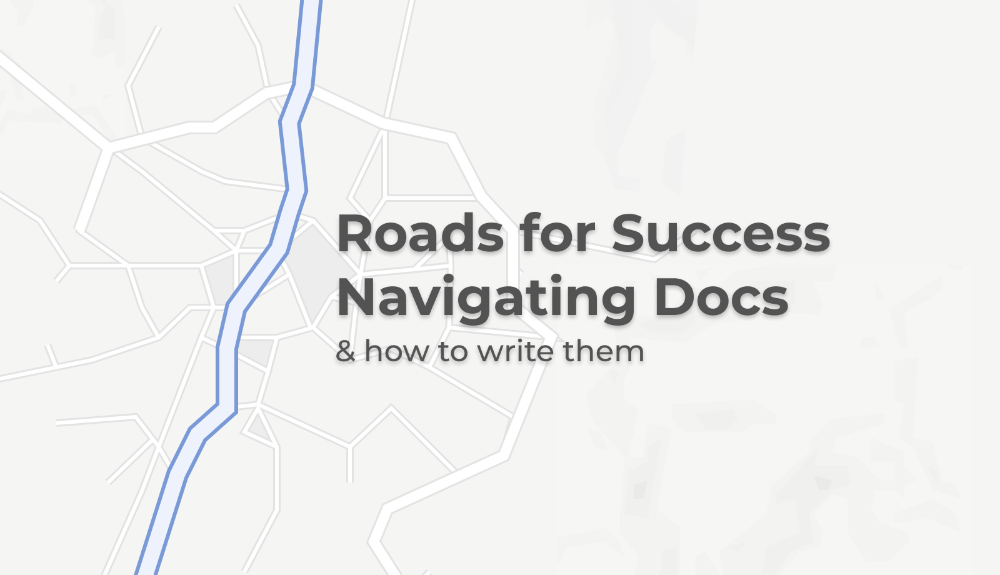
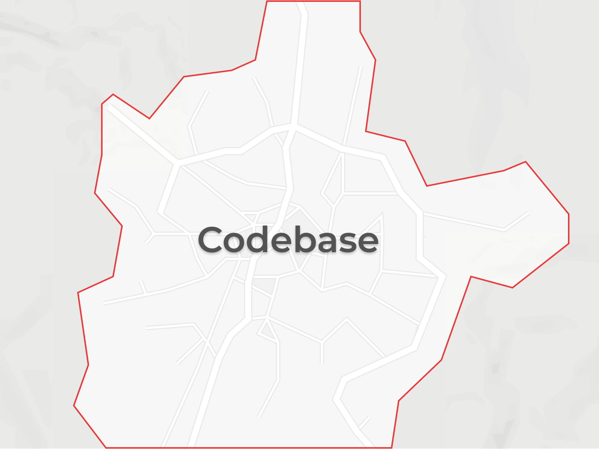
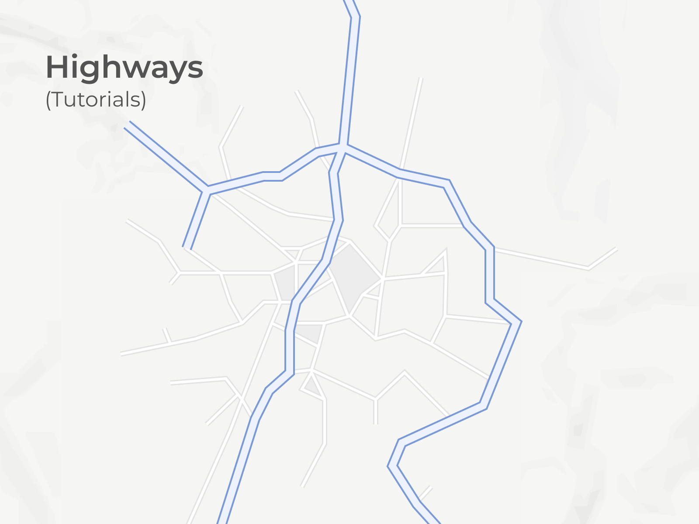
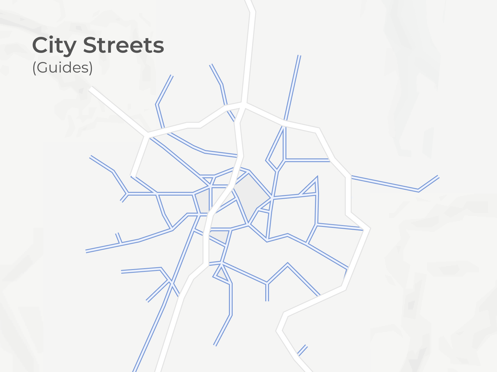
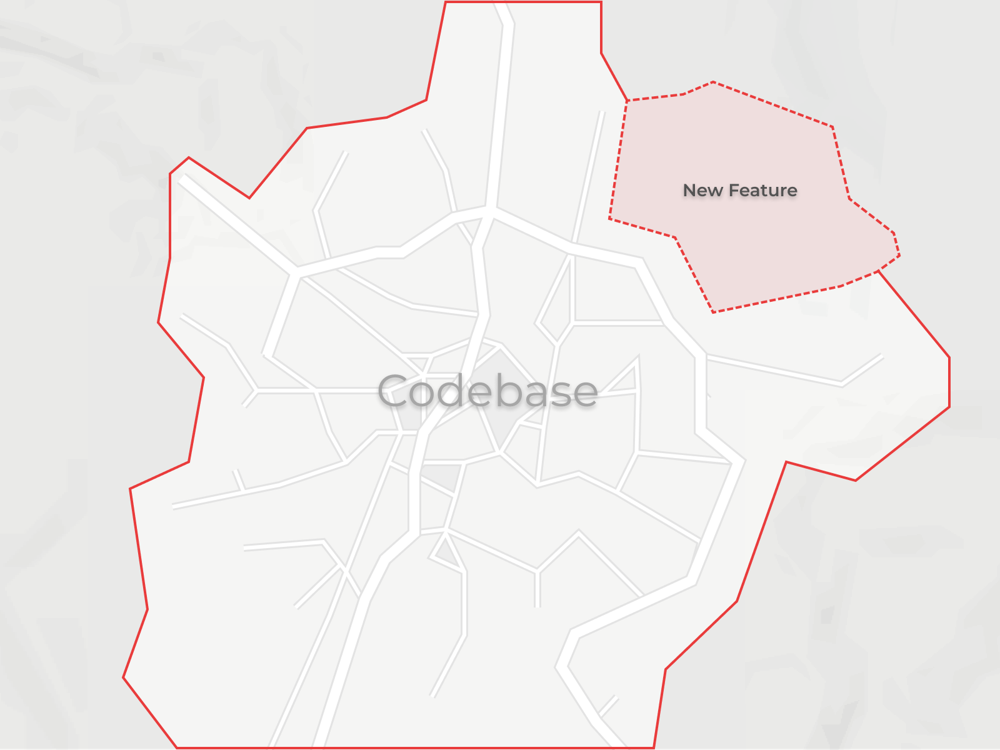
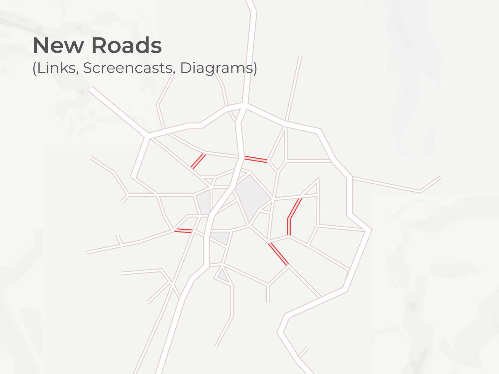

After a year being closely involved on the [docs for Gatsby](https://gatsbyjs.org), I've learned a thing or two and have started seeing patterns in it and other projects about what can make them successful.

Developer documentation is a _highly_ undervalued piece of a project. Docs become a key part in driving adoption of a project for beginners, as well as teaching how to best extract value for power users and experts. Still though, many projects underinvest in them.

**Docs are like roads**. They need to be repaired, maintained, and developed. Some require a different speed as you traverse them, and much like public infrastructure, good docs need to provide multiple pathways to different locations in order for developers to navigate them successfully.

## Consider the analogy

Push the analogy a little and you'll start to see some relevant connections. I'll examine the following parallels:

- roads of different speeds give drivers options for navigating from point A to point B, just like varying levels of guidance in documentation makes it easier for developers of all skill levels to implement code in their own projects
- maintenance on old roads is often cheaper and more valuable than paving entirely new ones, just as improving old docs can be more valuable to learners than creating a new guide
- creating new roads extend how far drivers can travel, but make maintenance more complicated, just like new features to code
- government is requisite to maintain and operate roads, and some level of governance is important to properly maintain docs at scale

I'll pretend that some imaginary codebase is a city, and the roads around it are the documentation that teach about it:

## Happy paths and highways

When a driver sets off on a long trip, they'll likely choose to take the highway. It's the fastest, has the fewest stops, turns, and obstacles, and gets you to a faraway destination in the shortest amount of time. For a short trip around the town, they'll have to take some back roads and city streets, which require frequent stops and turns. Those stops and turns are necessary however, to help facilitate oodles of more connections between places of interest than the highway can.

The majority of the Gatsby docs can be divided into two buckets: tutorials and guides. The main difference being that tutorials hold the user's hand a little more and go step-by-step, whereas guides are shorter, assume a little more knowledge, and link off to other relevant content.

**Highways are like tutorials. An essential part of making sure docs are easy to navigate is ensuring that there is a happy path to success for new people picking up your project for the first time**. These paths offer minimal friction, link off to relatively few resources, and allow users to get up to speed without many distractions to get them where they want to go. Compare this to a highway or interstate. To get vehicles from point A to point B in less time, highways offer a fast track that isn't slowed down by traffic lights, turns, or decisions. You can travel at a faster speed because there are simply less possibilities.

**City streets and backroads are like guides. They offer more connections to relevant info in smaller chunks that make connecting ideas in different ways easier**. A city full of highways would be near impossible to navigate. A project with docs that only contain long, step-by-step tutorials suffers the same fate. Guides facilitate connection between important concepts in a project while keeping them useful on their own. They may not move as fast as tutorials, but if someone knows their way around they can still get from point A to point B in a similar amount of time.

I've seen that some projects lack the investment into docs to set up multiple paths and offer a linear set of getting started steps. This is okay when you want to get from a very specific point A to a very specific point B, but falls short when you want to exit that path prematurely or start exploring elsewhere.

**Learning is more like a graph with nodes and edges than a ladder with steps.**

### Examples in Gatsby's docs

[Gatsby's tutorial](https://www.gatsbyjs.org/tutorial/) limits external links intentionally, like the highway. It's made to let users get up to speed quickly without sending them off down other roads. Users aren't slowing down to make sure they're turning at the right places, they can drive straight ahead at a cool 65mph (100kmh) making easy progress towards their destination.

In addition to that happy path, Gatsby has a host of other docs that also offer more specific guides and tutorials to cater to moving slower and more deliberately. If someone is familiar with the landscape of roads as they exist already in Gatsby-land, they might benefit from a backroad that gives them a turn right where they need it. Generally, the more specific the content of the doc, the more linking materials can be included to accommodate alternate paths.

## Maintenance, and filling in Potholes

Fellow Gatsby-ite [Marcy Sutton](https://twitter.com/marcysutton) once described the easy wins in fixing docs that were missing simple links or explanations as "filling potholes". I thought the comparison was particularly insightful as it related to this analogy, because of the value add it offers from little effort.

It seems to be a natural tendency to think that with the development of a new feature making a new guide creates a more direct route to learning a new concept. But in that event, users run into the confusion of not knowing which of two guides is most correct. They're left bouncing between _both_ guides where before they could confidently follow one. In these situations, I think it most valuable not to carve a new path, but fill in the potholes of the tried and true guides. This is also discussed more in the following section.

## Paving new roads

New features launches for a project are exciting. It feels like bushwacking out into open terrain, discovering green fields that no one has ever touched or seen. In order to help others follow the same path, some sort or trail needs to be marked. That new feature needs to be documented lest your discovery lay hidden until the next intrepid explorer plants their flag in it and marks a clearer path. Over time that road will get travelled by more and more explorers, solidifying the path and smoothing out rocks and bumps.

New, undocumented features stretch the city limits farther out. The farther the city extends, the harder it becomes to connect all the functions and utilities of the city. If new features are added, new roads need to be paved to meet them.

Don't forget that paving new roads for new features comes with the cost of maintenance (like all engineering efforts).

It is suitable to pave new roads when they can help a user learn in a different way. Learning content in different formats like links to supported content, screencasts, and diagrams are all examples.

### Does it make sense to remove roads?

In urban planning, the [induced demand phenomenon](https://en.wikipedia.org/wiki/Induced_demand) explains how adding lanes to highways actually slows down traffic, and the [Braess paradox](https://en.wikipedia.org/wiki/Braess%27s_paradox) explains how closing old roads can actually speed up traffic. Although it's counterintuitive, I think there is also something to learn from these concepts as it relates to documentation:

**Fewer, well-maintained docs can be much more valuable than many poorly maintained ones.**

Old docs will get out of date faster as you are left maintaining two docs instead of one, time wasted on that maintenance keeps you from writing docs for new features... the list can go on. Like with many things you can improve the value of your efforts by narrowing the scope of its focus.

## Open Source Governance

In his piece on [Founding Organizations](https://www.gatsbyjs.org/blog/2020-02-11-founding-organizations/), Sam Bhagwat discusses how open source projects need the right level of governance to subsist. The government of the project is responsible for managing the infrastructure of the project, maintaining code quality, expanding and developing portions of its code base based on user feedback, and also—maintaining the docs. For governments, the income for that maintenance is through taxes; for open source, it's often through products or services built around a project.

An open source project is the governing body that keeps the docs updated and maintained like municipal governments keep roads operational and maintained.

Gatsby invests into open source to make continual maintenance sustainable, which keeps me investing into it as a contributor. It's a virtuous cycle.

## A network of connections

What makes Gatsby's docs so useable is capitalizing on **varying levels of depth, and creating the right connections** between all of it. When connections are under-documented (which is most commoon in the periphery of the "new features" type space), roads need to find a way to them.

Docs are like roads.

So what's a [GPS](https://www.gatsbyjs.org/blog/2020-04-15-announcing-gatsby-recipes/)?... 😉
