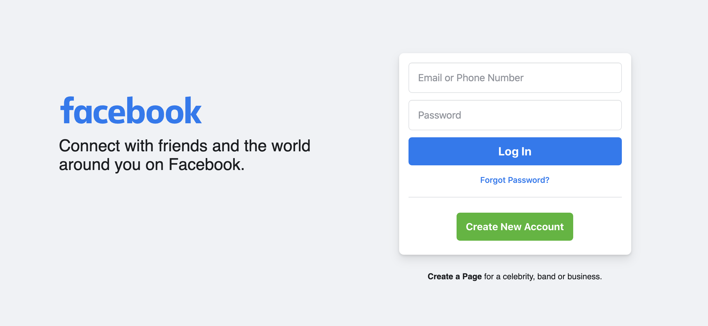
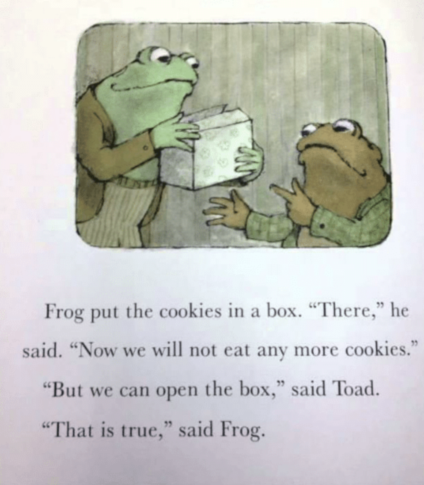
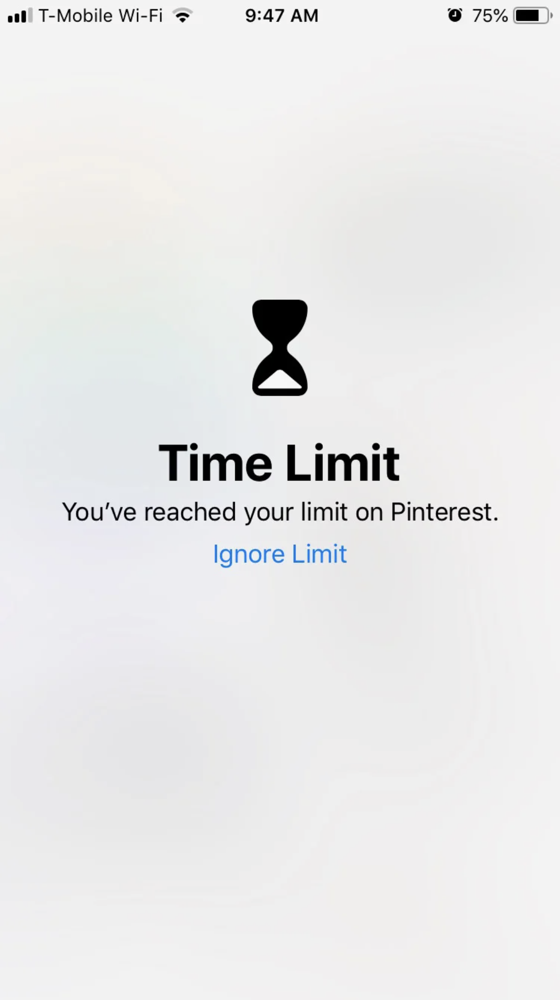

For a long time I've been a fan of digital solutions for real-world problems. Parents won't get you a dog? Tomagotchi. Need a way to connect with friends during a worldwide pandemic? Among us. Need something to do by yourself during a worldwide pandemic? Also Among us.

I've gone all in on digital. When I got a laptop for college I customized everything about it; I had keyboard shortcuts and bookmarks to every medium I consumed. It was my toolbox to accessing information as fast as my 75 words per minute (I played a lot of TyperShark) fingers could ⌘ (Command) + Space and enter a command.

I felt like I had instant access to everything and everyone, and technology really seemed to be working to my advantage. I was discovering musicians on SoundCloud years before they won Grammys, I was using WolframAlpha to do my math homework, and my Google+ feed was just about to make me an influencer right before gave the platform the boot (you can't prove me wrong 😉). Identifying myself as a techie person (I'm a software engineer by day), I was starting to feel like I'd optimized about as much as I could.

## Recognizing the Problem

I didn't think any of my digital habits were a problem for the most part. I don't really watch TV by myself, and I haven't had much of a taste for video games for a long time. Apparently what they said was true and I watched enough Spongebob as a kid to turn my brain to mush, and now what I think is fun is writing code on my Friday evenings.

What I'm saying is I thought that I was using technology appropriately for the most part, then a few events coincided simultaneously:

- I found myself relying on technology more and more when COVID-19 shut down a lot of the world.
- I started reading Digital Minimalism by Cal Newport and resonated with a lot of his points.
- I graduated from college and had more free time on my hands than chimpanzee with a time turner.

It was then that I started to notice how I would instinctively open up Twitter minutes after closing it. Muscle memory would make me check Slack (yes that Slack*, like for work*) and email multiple times in the evenings. I'd open up Instagram through the Chrome browser on my phone (I don't have the app), and I don't even really _use_ Instagram.

"Connect with friends" they said...

Paradoxically, the all powerful feeling I had with technology wasn't delivering on its promise to make me feel connected and productive. I had already taken a few measures to try and not be dependent on social media in particular (remember the thing about not having the Instagram app?), but I decided to give the digital declutter Cal Newport talks about in his book a try, and take 30 days off of optional technologies and only reintroduce the most essential ones.

## The Philosophy of Digital Minimalism

Cal Newport talks about digital minimalism as this idea that technology is working against us, and most of us use it as a "maximalist". A maximalist—meaning—I'll use as many tools as I can that might provide some small benefit or utility to me. This flies in the face of the idea of minimalism which instead suggests you define your priorities first, and then only introduce the tools you need to reach those priorities.

I had already set my goals so defining the priorities wasn't too hard, but I knew I needed some limits to take all the social media feeds out of the equation for a month if I were going to try what Cal Newport suggested.

## The Rules I Set

James Clear makes a pointed statement in his book Atomic Habits:

> “You do not rise to the level of your goals. You fall to the level of your systems.”

I saw this happening to myself ever since I returned from my 2 year, church service mission for the Church of Jesus Christ of Latter-day Saints. I had high aspirations that I kept failing to meet when I didn't keep the same rigor around my daily schedule and work ethic as I did as a missionary. I figured the solution might be in adding on more rigor.

In regards to digital minimalism, I had high aspirations for how I'd use technology, but it didn't matter because I didn't have the willpower (or something) to keep me from opening up some deity in the pantheon of the attention economy.

A pointedly profound life lesson from 2 of literatures finest: Frog and Toad

So I set rules and limits. Lots of them.

- I set up a [Pi Hole](https://pi-hole.net/), which blocks ads and my own list of distracting sites at the network level (meaning that my devices can't even access them when on my WiFi).
- I wrote [a custom Chrome extension](https://chrome.google.com/webstore/detail/scroll-solace-hide-social/pkkpjcbjoplobnnihelcjnigckibeaog/related?hl=en) that would remove all social media feeds from my laptop and replace them with empty white space and little messages like "are you sure you need to be on Twitter?"
- I made a clean sweep of my phone and deleted _all_ social media apps and games from my phone (except for Among Us for obvious reasons, because I'm not about social self-sabotage).
- I got [an app](https://play.google.com/store/apps/details?id=com.stayfocused&hl=en_US&gl=US) on my phone that would lock internet browsing after 5 consecutive minutes, it reset every hour so I could look up small things I needed but wouldn't get lost browsing. The lock can only be removed with a password (none of this nonsense built into Apple and Android that allows you to bypass your own limit, more on this later), and my friend's email is where the reset email gets sent.
- I removed phone chargers from my room and turn off my phone every night when I start my nightly routine. I charge it in another room downstairs and don't pick up my phone again until I've gotten other parts of my day started.
- I set my phone to Do Not Disturb when I can during the day unless I'm expecting a text or call so I'm not constantly bombarded by a ruthless barrage of notifications from my friends (mostly Duo the owl) demanding my time and attention.

Now I'd like to pose a question.

Do you notice anything alarming about this photo? I imagine many have seen it.

Mucho Apple design dollars went into designing and implementing this screen.

Consider the fact that **the only** call to action (call to action meaning the thing you're being persuaded to do) on this screen is "Ignore Limit". The ONLY button. There's no where else the design is encouraging you to click except for the very one to bypass the protection you've set. It feels hollow, like Apple is showing an alcoholic out of a bar while dangling a bottle of cold ones in front of them at the same time.

Recall the start of this section:

> “You do not rise to the level of your goals. You fall to the level of your systems.”

I think with how well digital experiences are designed, there have to be some serious systems in place to have any real effect on them.

## Dominion as a Pattern for Successful Minimalism

One of my favorite games is called Dominion. It's a deck building game where you start with some lousy cards, and have to use them to start buying up better and better cards to build a better deck. I think it has a lot of parallels with life and minimalism.

There are 3 kinds of cards, actions, money, and points. Actions and money help you buy other cards, but aren't worth anything. Point cards may help you win, but can fill your deck up with cards that don't serve any purpose during the game when you draw them. A beginner strategy is to buy a card every turn you can (even if that card is a copper, worth only 1 money, but not realistically very valuable), and try and fill your deck up with different cards. However, if you focus on acquiring cards you tend to end up with a cluttered deck full of cards that don't work well together. One of the better strategies is getting cards that trash (read remove) other cards from your deck. In that way you can remove the ones that don't add value, and replace them with worthwhile cards that match your strategy.

Rather than filling life with cards like a maximalist, I've found it's worth it to consider trashing some so I can focus more on the stuff I care about. On any given day I can open up Twitter, but I get a lot more out of things when I actually _remove_ Twitter from my deck.

## How it Went

Newport mentions how ineffective labeling a 30 day declutter as a detox is in his book. I had actually experienced that myself when I came home from my mission. I didn't use really any digital stuff for 2 years, and came back and almost jumped right back into the same sluggish habits of my past.

I started my digital detox on July 4th (I figured a fitting day to celebrate freedom), and didn't formally end on August 3rd when 30 days had passed because I didn't really feel much of a need to go back to old habits quite yet. A few days later I jumped on Twitter to find that the very first tweet I was recommended was a crass and kind of unsavory video. I subsequently closed Twitter and haven't looked back. It's actually felt, dare I say it, rewarding.

## Things I'm learning

Sure, there are positive outcomes to being online and having access to so much content, but _the vast majority_ of that content happens to be vitriol, smut, nonsense, or all three. It offers nothing in return for all the mental drain it causes.

Mediums like books on the other hand, are carefully edited treasure troves of the best ideas. I realize the irony of this, writing a blog post proclaiming books offer a better alternative to being online, but I think of it more as a spectrum than a dichotomy. Books are among the best places to spend time, while feeds are (in my opinion) the worst. Carefully selected podcasts and blogs although digital offer a great place to spend time. Other mediums like ebooks combine digital solutions like full text search with the pros of not having all the same apps and distractions built in.

### To read

I spent years online digging through dumpsters looking for flecks of gold, when I could have been reading and pulling whole nuggets out of the an author's mother lode. When an author has to challenge their ideas, discuss them with others, formulate a thesis, and turn it into a book, they sand off many more of the rough edges of an idea than when a wandering thought leads to them tweeting. So why spend so much time absorbing noise on Twitter when author's are purposefully and intentionally channeling their ideas into signal via books?

### To write

I've learned that writing is a valuable usage of time. Writing happens in many places for me now but the most common things I write about are:

- personal reflection in my private journal on [https://github.com/gillkyle/sol-journal](https://github.com/gillkyle/sol-journal)
- my favorite meaningful songs as a creative outlet on my music blog at [https://www.audio-vault.com/](https://www.audio-vault.com/)
- my weekly study of scriptures at [https://study.kylegill.com/](https://study.kylegill.com/) (I also have a few notebooks where I jot down thoughts and things I like)
- connected ideas that bridge my goals with economics, business, spirituality, and technology at [https://notes.kylegill.com/](https://notes.kylegill.com/)
- drafts of blog posts on Notion
- impressions I receive that I want to record, also on Notion

I feel like I've been learning a lot, but as it turns out, it's still kind of hard. So for now, a lot of my goals are aspirational (since I'm typing up this last paragraph while finishing my 3rd episode of Psych).

I'm not a pro at digital minimalism, but I am a big proponent.
